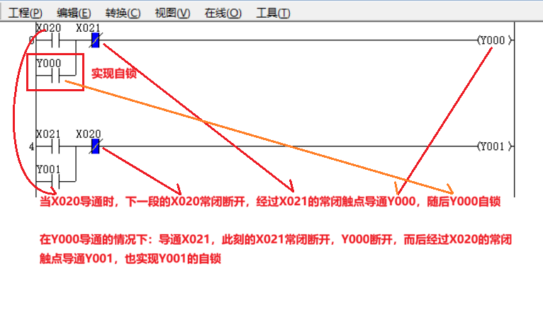
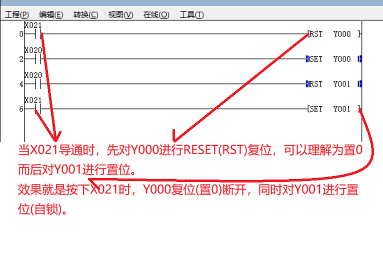
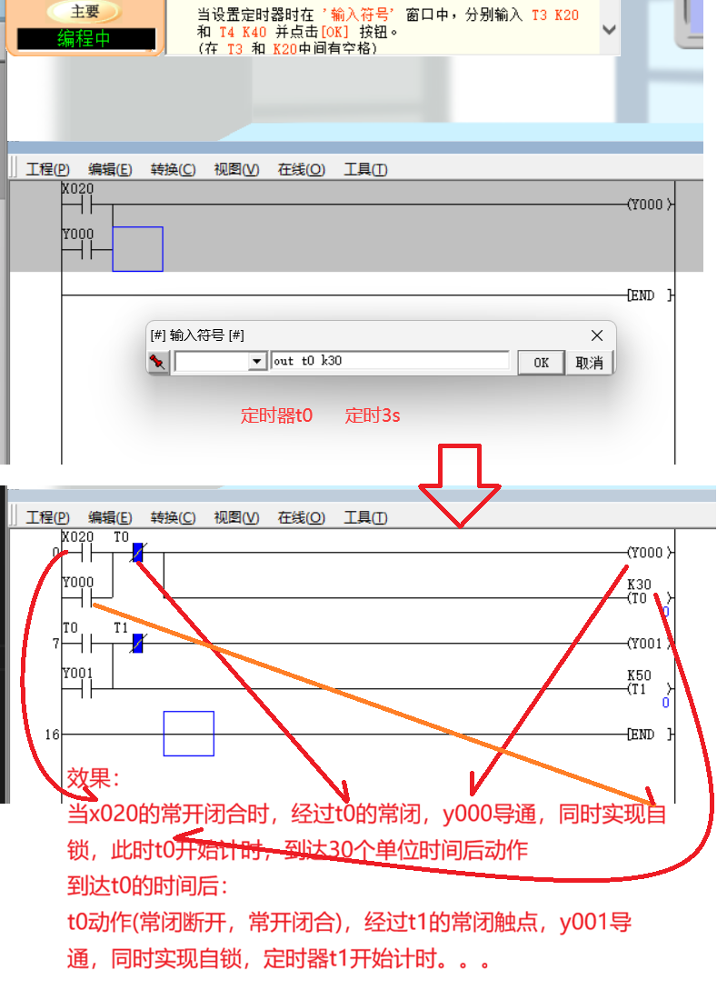
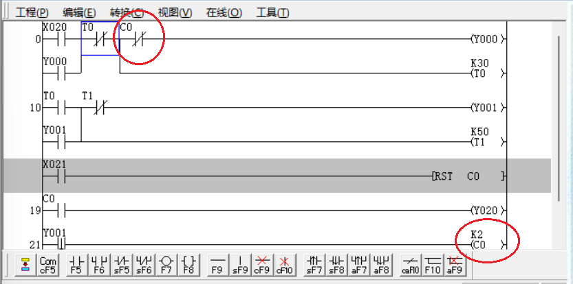

# 目录
- 
    - [1.1 PLC基础指令](#11-PLC基础指令)

    - [1.2 理解例图](#12-理解例图)


### 1.1 PLC基础指令
一般在指令后加“I”是取反的意思
- LD(取) 
    > 可以理解为`点动`的意思，既点动闭合的按钮

- LDI(取反) 
    > 可以理解为`常闭`的意思

- OUT(输出)

- AND(与)

- ANI(与非)

- OR(或)

- ORI(或非)

- ANB(逻辑块与)

- ORB(逻辑块或)

- END(结束)

- SET(置位)

- RESET(复位)
    > 最好时放在SET(置位的前面)，因为指令的扫描是“从左到右，从上到下”

- PLS(上升沿)
    > LDP、ANDP也是上升沿的意思

- PLF(下降沿)
    > LDF、ANDF也是下降沿的意思
- ZRST(整批复位)
    > zrst y5 y22这个意思是在这个[y5,y22]区间内的都会被复位

---

### 1.2 理解例图
1. 自锁
    ```
    LD X020         //相当于常开 按钮
    ANI X021        //相当于常闭 按钮
    OUT Y000        //相当于线圈主触点
    OR Y000         //相当于线圈常开触点，导通后自动吸附

    AND X021        //相当于常开 按钮
    ANI X020        //相当于常闭 按钮
    OUT Y001        //相当于线圈主触点
    OR Y001         //相当于线圈常开触点，导通后自动吸附
    ```
    

2. 置位与复位
    ```
    LD X021         //相当于 点动开关 的 常开
    RST Y000        //可以理解为释放自锁触点，也可以理解为置0
    AND X020        //相当于 点动开关 的 常开
    SET Y000        //可以理解为自锁，也可以理解为置1

    AND X020        //相当于 点动开关 的 常开
    RST Y001        //可以理解为释放自锁触点，也可以理解为置0
    AND X021        //相当于 点动开关 的 常开
    SET Y001        //可以理解为自锁，也可以理解为置1
    ```
    

3. 定时器
    ```
    LD X020         //常开开关
    ANI T0          //常闭
    OUT Y000        //线圈
    OR Y000         //线圈常开触点
    OUT T0 K30      //定时器启动开关

    AND T0          //常开；定时器没有动作时是断开的
    ANI T1          //常闭；定时器启动后，到达设定的时间后做动作，断开
    OUT Y001        //线圈的主触点
    OR Y001         //线圈的常开辅佐触点
    OUT T1 K50      //定时器T1的启动开关；使用计时器T1 50个单位时间后动作
    ```
    

4. 计数器(在上一个定时器的基础做的演示)
当Y001断开(下降沿)时触发计数器C0，当计数器技术2次后，计数器动作(**常闭**触点**断开**，**常开**触点**闭合**)
    ```
    LD X020         //常开开关
    ANI T0          //常闭
    ANI C0          //计数器的常闭
    OUT Y000        //线圈
    OR Y000         //线圈常开触点
    OUT T0 K30      //定时器启动开关

    AND T0          //常开；定时器没有动作时是断开的
    ANI T1          //常闭；定时器启动后，到达设定的时间后做动作，断开
    OUT Y001        //线圈的主触点
    OR Y001         //线圈的常开辅佐触点
    OUT T1 K50      //定时器T1的启动开关；使用计时器T1 50个单位时间后动作

    AND X021        //常开；此操作对计数器进行复位
    RST C0          //复位定时器C0
    AND C0          //定时器的常开
    OUT Y020        //提示到达计数次数
    ANDF Y001       //下降沿触发
    OUT C0 K2       //计数器进行计数
    ```
    

5. 储存器
    `inc d0`
    用d0记录

