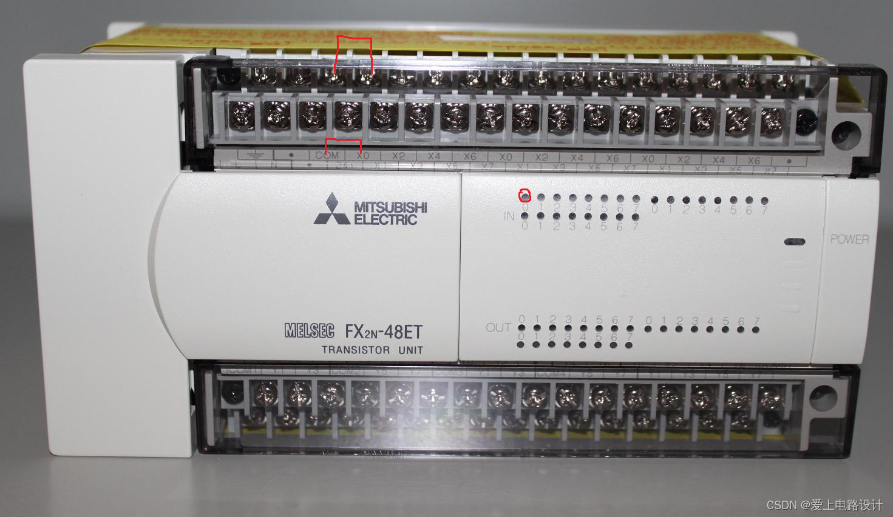

# 编程语言和编程工具
- LAD(梯形图)
- FBD(功能块图)
- STL(语句表)
- SCL(结构化控制语言)
- GRAPH(图形编程语言)

# 认识PLC
- 接口解读
    - X点（输入）
    - Y点（输出）；输出有晶体管和继电器两种方式
- 当com与任意X点短接，对应的指示灯就会亮

# 工作过程
1. 对于梯形图而言，按照“从左到右，从上到下”的顺序逐条执行指令。