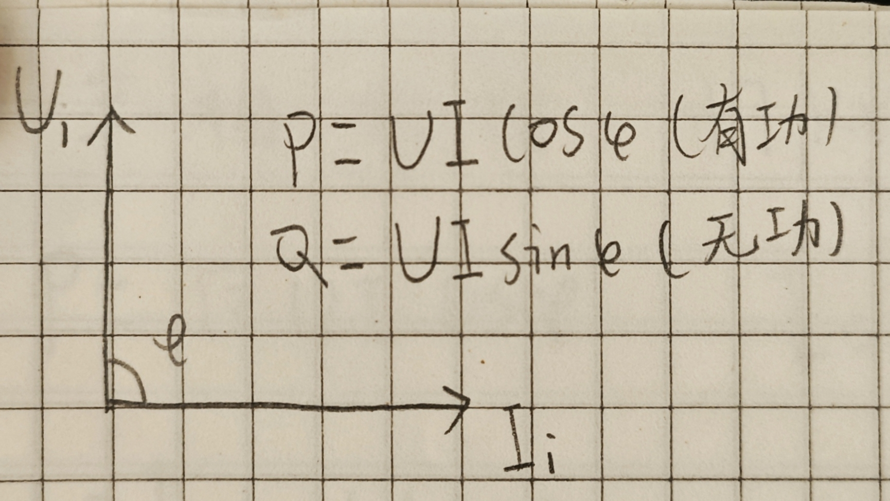
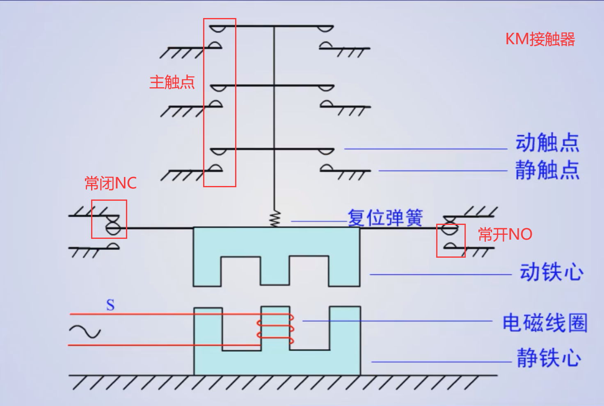
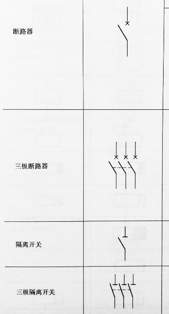

# 基础电气技术：
`(空调)一匹≈850W`

- 有功功率(P)
- 无功功率(Q)
- 视在功率(S)
- 交流功率P=√3UIcosφ

#### 控制类
1. 接触器(KM)
    
    线圈通电后，线圈电流会产生磁场，吸引动铁芯，并带动交流接触器点动作，常闭触点断开，常开触点闭合。
2. 中间继电器(KA)
3. 直流接触器(KMD)

#### 过载/保护类
1. 热继电器(FR)

#### 操作/指示类
1. 按钮开关(SB)
2. 自锁按钮开关(SA)
3. 行程开关(SQ)

#### 配电类
1. 熔断器(FU)
2. 高压隔离开关(QS):没有灭弧功能，不能带负荷操作
3. 高压断路器(空气开关)(QF)

通电：先QS再QF
断电：先QF再QS

