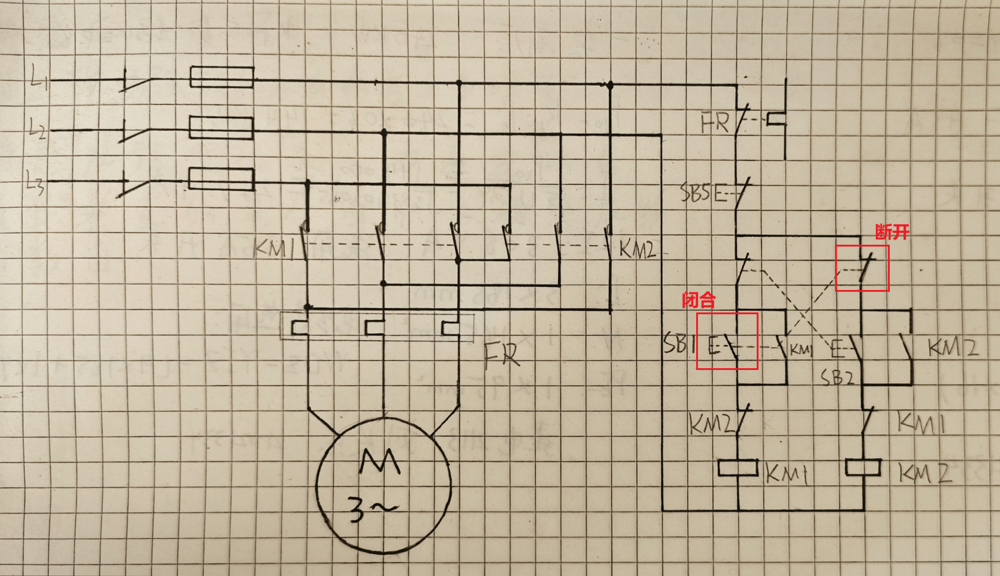
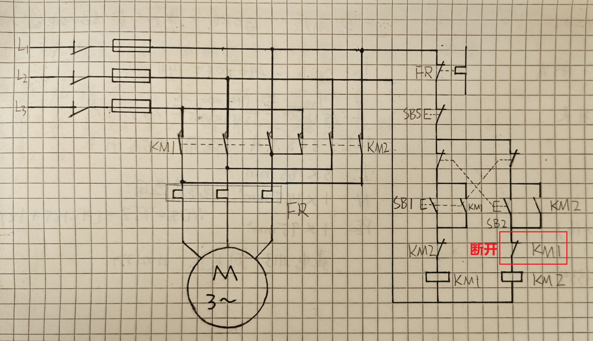
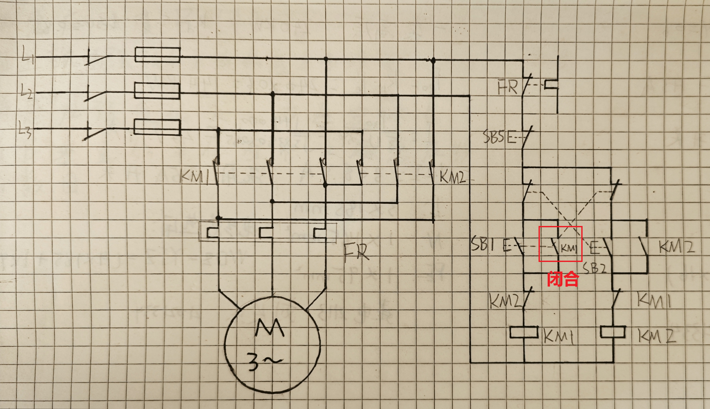
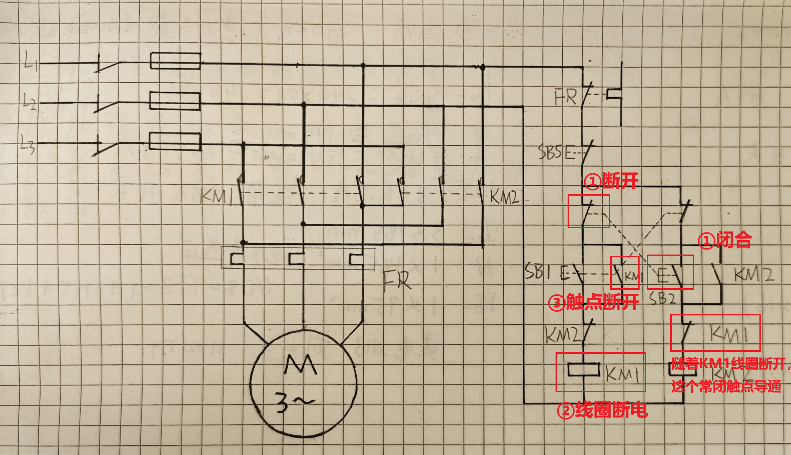

# 基础电气技术：
`(空调)一匹≈850W`
```
通电：先QS再QF
断电：先QF再QS
```
- 有功功率(P)
- 无功功率(Q)
- 视在功率(S)
- 交流功率P=√3UIcosφ

#### 控制类
1. 接触器(KM)
    
    线圈通电后，线圈电流会产生磁场，吸引动铁芯，并带动交流接触器点动作，常闭触点断开，常开触点闭合。
2. 中间继电器(KA)
3. 直流接触器(KMD)
---
#### 过载/保护类
1. 热继电器(FR)

#### 操作/指示类
1. 按钮开关(SB)
2. 自锁按钮开关(SA)
3. 行程开关(SQ)

#### 配电类
1. 熔断器(FU)
2. 高压隔离开关(QS):没有灭弧功能，不能带负荷操作
3. 高压断路器(空气开关)(QF)


---


## (正转)当按下SB1时：
1. SB1`常开`触点闭合，SB1`常闭`触点断开
2. 此时KM1线圈通电，此时KM1的`动断`触点断开  
`动合`触点闭合导通实现自锁
3. 电机通过接触器KM1的主触点通电启动

## (反转)在电机正转的基础上，当按下SB2时：
1. SB2`常开`触点闭合，SB2`常闭`触点断开、KM1线圈断电、KM1的动合触点断开、KM1的断合触点导通、电机断电

2. 此时KM2线圈通电，此时KM2的`动断`触点断开，KM2`动合`触点闭合导通实现自锁
3. 电机通过KM2的主触点导通，实现反转。

## 当按下SB5时：
KM1、KM2两个线圈都断电，释放所有主触点，实现电机停转

---