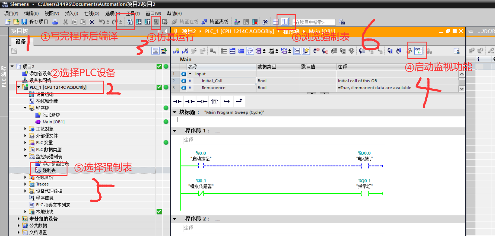

#### 注意细节
1. 对PLC的**防护与安全**取消`加密`，访问级别为`完全访问`
2. **系统与时钟存储器**勾选`启动系统存储器字节`与`启动时钟存储器字节`
## 仿真步骤
启动：

退出：关闭Siemens；点击菜单栏的转至离线

### 输入(I)
一般按钮、传感器、开关等，用`I`表示
例如I0.0
> 小数点前数字代表*编号*
>
> 小数点后数字代表*第几位*
    >> 位数范围[0，7]，共8位

### 输出(Q)
一般灯泡、接触器、中间继电器、电磁阀等，用`Q`表示
例如Q0.0
> 小数点前数字代表*编号*
>
> 小数点后数字代表*第几位*
    >> 位数范围[0，7]，共8位

