# PLC工程师程序设计思路
1. 限制按钮的动作次数，对于某项按钮，防止在运行过程中误触，导致事故的发生
    1. 例如启动按钮
    - 当按下启动按钮时，之后再按启动按钮不会有任何动作
    - 这是利用`步骤0`自身的`常闭`进行限制

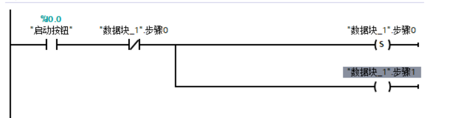

#### 注意细节
1. 对PLC的**防护与安全**取消`加密`，访问级别为`完全访问`
2. **系统与时钟存储器**勾选`启动系统存储器字节`与`启动时钟存储器字节`
---
## [案例](案例.md)
---
## 仿真步骤
启动：

退出：关闭Siemens；点击菜单栏的转至离线

---
### 输入(I)
一般按钮、传感器、开关等，用`I`表示
例如I0.0
> 小数点前数字代表*编号*
>
> 小数点后数字代表*第几位*
    >> 位数范围[0，7]，共8位

---
### 输出(Q)
一般灯泡、接触器、中间继电器、电磁阀等，用`Q`表示
例如Q0.0
> 小数点前数字代表*编号*
>
> 小数点后数字代表*第几位*
    >> 位数范围[0，7]，共8位
---
### 全局变量DB
中间变量，不需要填写地址，不需要接线的变量
1. 创建方法：
- 左边项目树里
    - 程序块
        - 添加新块
            - 数据块(DB)

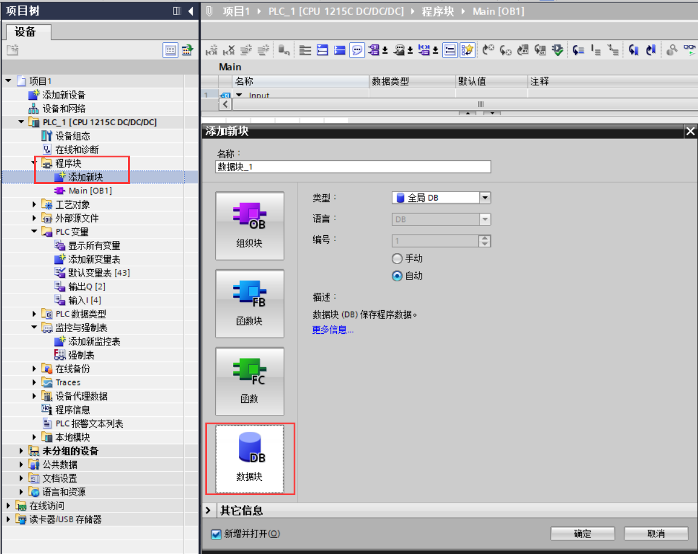

---

### 闪烁函数
不同型号的PLC，地址不一样，具体可以看`系统与时钟存储器`
- 需要勾选上PLC里**系统与时钟存储器**的`启动系统存储器字节`与`启动时钟存储器字节`

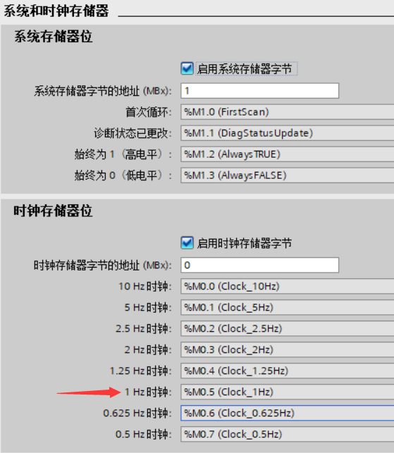

---

### 位逻辑运算
1. 上升沿(P-TRIG)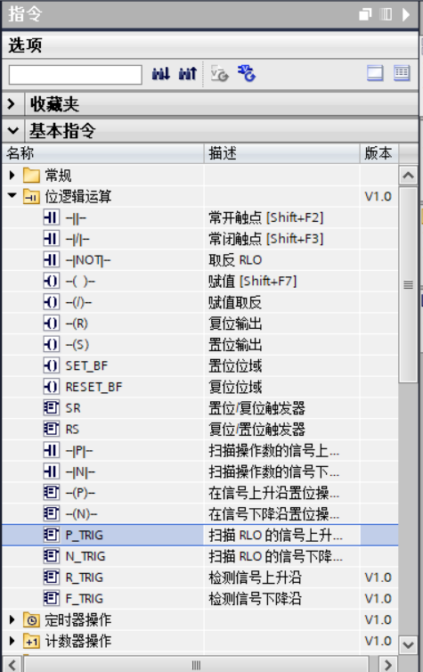
    - 1.1当CLK收到上升沿，Q将会导通1次。
        - 此为数据监视变量使用BOOL类型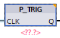

2. 置位(S)
    > 请看解读[PLC基础指令入门](../PLC基础指令入门.md)
3. 复位(R)

4. 批量复位(RESET_BF)
    - 上 为起始地址
    - 下 为 复位的个数
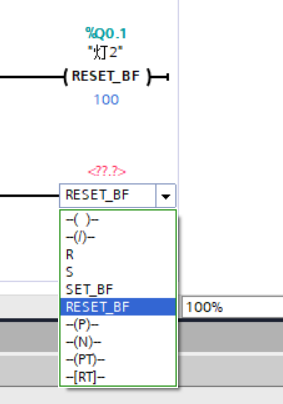

`上图就是起始地址Q0.1，往后复位100个地址，就是12.4，也就是Q0.1-Q12.4全部会置位，Q12.5会不会置位`

---

### 定时器
当前时间 = 设定时间 时，定时器产生动作(常开闭合，常闭断开)
1. 创建定时器
- 右边指令
    - 基本指令
        - 定时器操作
            - 双击`TON` 
            
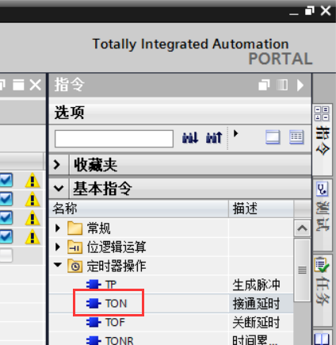

2. 名词解释
- `PT` 设定时间
- `ET` 当前时间

3. 运行条件
- `ET`需要变量，且类型要为Time
- `PT`需要设定时间，格式为`T#+时间+单位`；例如`T#3S`设定定时3S

---

### 比较指令
符合条件就导通
- 条件类型
    - 大于`>`
    - 小于`<`
    - 等于`=`
    - 不等于`<>`
    - 大于等于`>=`
    - 小于等于`<=`

1. 创建指令
- 右边指令
    - 基本指令
        - 比较操作
            - 选择需要的指令

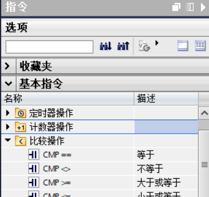

2. 指令运行条件解释
- 上：**变量**，要对比的数值
- 中：**数据类型**，规定对比数据的类型
- 下：**条件**，设定行动的条件

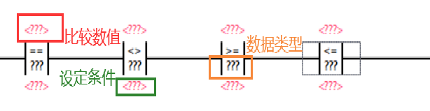

---

### 数学函数

1. 加法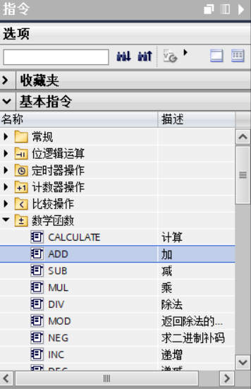
    - 当EN导通时，进行运算(建议使用上升沿or下降沿)

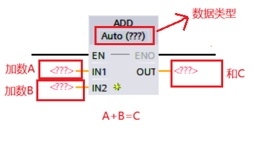

---

### 移动操作

1. 移动值(MOVE)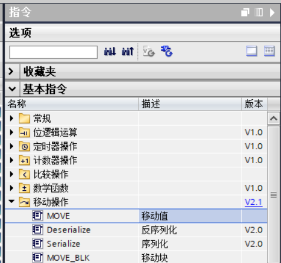
    - `IN`数值
    - `OUT`存放数值的地址or变量
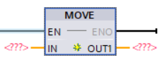

